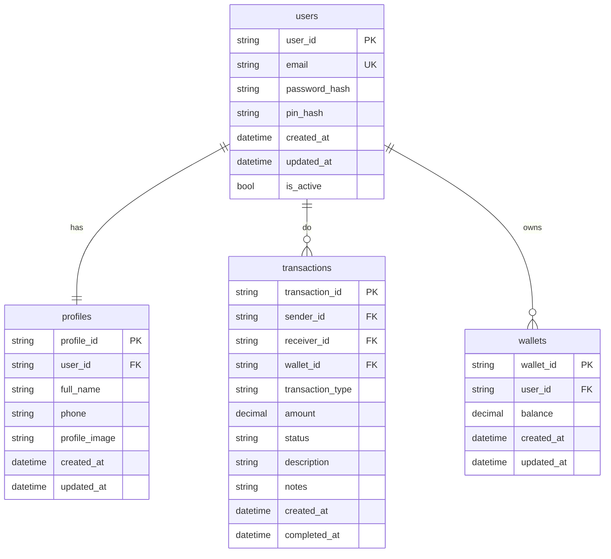

# ERD: E-Wallet

```mermaid

erDiagram
    users ||--|| profiles : has
    users ||--o{ transactions : do
    users ||--o{ wallets : owns
    
    users {
        string user_id PK
        string email UK
        string password_hash
        string pin_hash
        datetime created_at
        datetime updated_at
        bool is_active
    }
    
    profiles {
        string profile_id PK
        string user_id FK
        string full_name
        string phone
        string profile_image
        datetime created_at
        datetime updated_at
    }
    
    wallets {
        string wallet_id PK
        string user_id FK
        decimal balance
        datetime created_at
        datetime updated_at
    }
    
    transactions {
        string transaction_id PK
        string sender_id FK
        string receiver_id FK
        string wallet_id FK
        string transaction_type
        decimal amount
        string status
        string description
        string notes
        datetime created_at
        datetime completed_at
    }
```