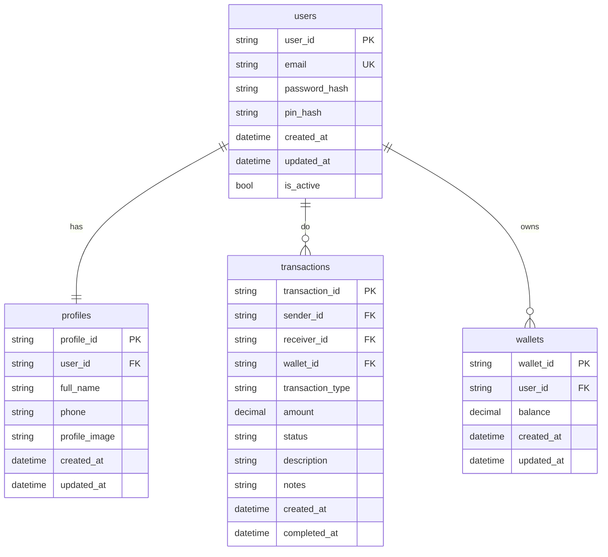

# E-Wallet Service

## Overview

Backend API ini dibangun menggunakan Go dengan framework Gin dan PostgreSQL sebagai database. Aplikasi ini menyediakan RESTful API yang scalable dan performant dengan arsitektur yang clean dan mudah dimaintain.

### Tech Stack
- **Go** (Golang) - Programming language
- **Gin** - HTTP web framework
- **PostgreSQL** - Primary database
- **Pgx** - Database & toolkit for go
- **JWT** - Authentication & authorization
- **Air** - Live reload untuk development
- **Docker** - Containerization

## Installation
### 1. Clone Repository
```bash
git clone https://github.com/devbydenis/fgo24-be-weeklytask.git
cd fgo24-be-weeklytask
```

### 2. Install Dependencies
```bash
go mod tidy

```
### 3. Environment Setup
Buat file `.env` di root directory:
```env
APP_PORT=8998

PGHOST=localhost
PGPORT=5433
PGDATABASE=postgres
PGUSER=postgres
PGPASSWORD=1
```

### 4. Database Setup
```bash
# Buat database
docker run -e POSTGRES_PASSWORD=1 --rm -p 5433:5432 --name be-weekly -d postgres
```

## Usage

### Development
```bash
# Install Air untuk live reload (opsional)
go install github.com/cosmtrek/air@latest

# Run dengan live reload
air
```
### ERD Design



### Authentication Endpoints
```
POST   /auth/register    - Register new user
POST   /auth/login       - Login user
```

### User Endpoints
```
GET    /users/profile/:id    - Get user profile
PUT    /users/balance/:id    - Get user balance
PUT    /users/edit-profile   - Edit profile
```

### Transaction Endpoints
```
POST    /transaction/transfer       - Transfer money between user
POST    /transaction/top-up         - Get user balance
GET     /transaction/history/:id    - Get history transaction
```

## Project Structure

```
.
├── controllers/         # HTTP handlers
├── middleware/          # Custom middleware
├── models/              # Database models
├── routers/             # Data access layer
├── utils/               # Utility functions
├── go.mod
├── go.sum
├── .env
├── .gitignore
└── README.md
```

## Contact

- Email: hello.denisrahmadi@gmail.com
- GitHub: [@devbydenis](https://github.com/devbydenis)